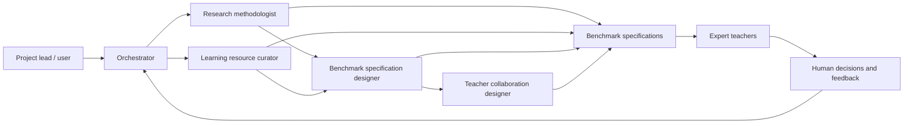
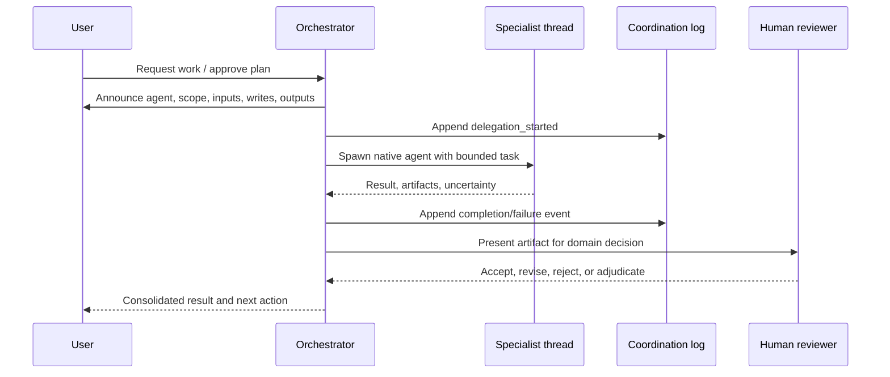

# System architecture

## Goals and principles

The system supports a human-in-the-loop research workflow for a Vietnamese lower-secondary Informatics LLM-tutor benchmark covering grades 6–9. As of 2026-07-23, grades 6–8 are part of the benchmark domain rather than only prerequisite support for grade 9. Its current architecture prioritizes:

- modular plans with explicit file ownership;
- expert-teacher authority over pedagogical and subject-matter decisions;
- canonical specialist definitions with thin runtime adapters;
- native, observable delegation instead of hidden subprocess agents;
- append-only coordination records and artifact-based handoffs;
- fail-closed or single-agent fallback when specialist activity cannot be inspected.

## System context



In plain language: the user directs the orchestrator; the orchestrator delegates bounded tasks to specialists. Research and learning-resource work can proceed in parallel; benchmark specification then synthesizes both streams; teacher-collaboration work turns approved or provisional specifications into clear teacher workflows. Expert teachers review pedagogical implications; the orchestrator records and applies the human decisions.

## Components and ownership

| Component | Location | Owner | Status |
|---|---|---|---|
| Canonical specialist skills | `agents/<name>/` | P01 + 20260701 Plan 01 | Implemented for four current specialists |
| Codex adapters | `.codex/agents/` | P01 | Fresh-session runtime smoke-tested |
| Claude adapters | `.claude/agents/` | P01 | Static validation; runtime deferred |
| Skill discovery links | `.agents/skills/` | P01 | Generated and validated by P01 |
| Coordination contract | `experiments/_templates/` | P01 | Implemented by P01 |
| Modular plans | `experiments/<id>/plans/` | Respective plan | Active |
| Shared raw data | `shared/raw_data/` | 20260709 Plan 02 | Implemented for HNMU dialogue manifests lớp 6–9; Plan 04 audit outputs cover lớp 6–7 and a separate follow-up run for lớp 8–9 |
| Shared learning resources | `shared/learning_resources/` | 20260709 Plan 02 layout / Plan 03 content | SGK/SGV images, derived PDFs, registries, Nguyen OCR Markdown for SGK/SGV Tin học 6–9, `ocr_text_manifest.csv`, `learning_resource_fragments.csv`, a rebuildable SQLite FTS retrieval index, and `agent_context/` for audit-agent navigation are available; OCR/MinerU probe outputs remain experiment artifacts and are not the primary retrieval source |
| Shared project package | `src/edu_benchmark/` | 20260709 Plan 02 layout; Plan 03/04 and 20260722 Plan 01 add logic | Data I/O, learning-resource fragmentation/retrieval, dialogue-audit v0, strict checklist-to-sample aggregation, and deterministic benchmark-conversion pilot tooling are implemented; full conversion and evaluation remain later plans |
| Benchmark conversion v0 | `src/edu_benchmark/benchmark_conversion/` and `scripts/benchmark_conversion/` | 20260722 Plan 01; Plan 02 draft | Plan 01 implemented schema validation, phase-1 evidence aggregation, hash-guarded human correction overlays, pass-input joins, deterministic pilot selection, final-student-turn analysis, and `final_tutor_response` splitting. Draft Plan 02 proposes migration to one candidate per tutor turn for all 665 pass dialogues; implementation has not started |
| Teacher workflow and packet | Future P03/P04 artifacts | P03/P04 | Not implemented |
| Benchmark specification specialist | `agents/benchmark-specification-designer/` | 20260701 Plan 01 / P05 support | Implemented as specialist support; benchmark content remains provisional |
| Learning-resource specialist | `agents/learning-resource-curator/` | 20260701 Plan 01 / P06 support | Implemented as v0 mapping support; database platform remains future P06 |
| Benchmark specification | Future P05 artifacts | P05 | Not implemented as official benchmark release |
| Dataset tooling | Future P06 artifacts | P06 | Not implemented as database platform |
| Evaluation pipeline | Future P07 artifacts | P07 | Not implemented |

Canonical logic belongs in `agents/<name>/SKILL.md` and its resources. Runtime adapters may configure discovery and execution but must not fork the workflow logic.

## Delegation sequence



The parent thread remains the decision surface. The user can inspect, steer, stop, or reject specialist delegation on supported runtimes.

## Observability model

Every delegation has:

1. a pre-delegation announcement in the parent thread;
2. a native agent thread when the runtime exposes one;
3. append-only events conforming to `experiments/_templates/coordination-event.schema.json`;
4. a handoff based on `experiments/_templates/handoff.md`;
5. paths to inputs and outputs;
6. a summary of the orchestrator decision and unresolved questions.

Observability covers messages exposed by the runtime, tool activity, artifacts, and decisions. It does not expose or claim access to private model chain-of-thought.

## Runtime model

| Surface | Delegation policy |
|---|---|
| Codex CLI | Use native custom-agent threads; inspect and steer with `/agent`. |
| Codex App | Use native threads when agent activity is visible. |
| Codex IDE Extension | If native visibility is unavailable, fail closed or use the canonical skill in the parent thread as single-agent mode. |
| Claude Code | Keep project adapters compatible; P01 does not run Claude runtime tests. |

Nested `codex exec`, `claude -p`, shell daemons, and hidden terminal agents are prohibited for interactive delegation. Non-interactive automation requires a separate approved plan.

The project keeps specialist fan-out conservative. `research-methodologist` and `learning-resource-curator` are pinned to `gpt-5.4-mini` with medium reasoning for default Codex subagent runs. `benchmark-specification-designer` is pinned to `gpt-5.4-mini` with high reasoning for synthesis. The orchestrator must not spawn multiple copies of the same specialist for one task unless the user explicitly approves the count, rationale, model, reasoning effort, input split, write paths, and merge plan. When fan-out is approved, each branch writes separate artifacts and the orchestrator or a dedicated synthesis task performs the merge.

## Python environment

The project has one authoritative Conda environment with platform-specific executable paths:

```text
Conda environment: benchmark_env
Windows Python: D:\conda-envs\benchmark_env\python.exe
Linux Python:   /home/quannda/miniconda3/envs/benchmark_env/bin/python
```

Package installation, project scripts, validators, and tests must run with the matching `benchmark_env` interpreter for the active platform. Direct Python dependencies are pinned in `requirements.txt`. Agents must not install project packages into Conda base, system Python, or an ad-hoc virtual environment. Temporary isolated tooling is allowed only when an approved plan explicitly requires it and the result does not represent project validation.

## Permissions and safety

- The orchestrator declares allowed read/write paths before delegation.
- Specialists must stay within delegated paths.
- Unsupported or unobservable delegation fails closed.
- Single-agent fallback loads the canonical skill in the parent thread without pretending that a specialist process exists.
- Existing unrelated user changes are preserved.
- Expert-teacher decisions are recorded, not silently rewritten by agents.

## Dependency direction

P01 owns the original agent infrastructure and root coordination contract. The 20260701 specialist-expansion plan adds `learning-resource-curator` as P06 support and `benchmark-specification-designer` as P05 support. P02 may consume the research specialist but does not modify it without a P01 migration. P03/P04 consume teacher-workflow capabilities. P05–P07 still own official benchmark, dataset, and evaluation artifacts respectively.

For experiment `20260709_155523`, Plan 02 owns the shared layout contract:

- `shared/raw_data/` stores unmodified raw inputs and manifests;
- `shared/learning_resources/` stores reusable SGK/SGV assets, OCR, registries, and fragments;
- `src/edu_benchmark/` stores reusable code for data I/O, audit, conversion, learning resources, and benchmark quality checks;
- `experiments/<id>/outputs/` stores run-specific derived outputs.

Plan 03 may populate `shared/learning_resources/` and its learning-resource manifest, but should not redefine the Plan 02 layout without an explicit roadmap update. As of 2026-07-18, Plan 03 Phases 0–2 have copied SGK images, crawled SGV images, created derived PDFs, and produced v0 topic/lesson/position registries for Tin học 6–9. Phase 3 OCR probes remain useful as technical evidence, but the current shared retrieval source is Nguyen OCR Markdown under `shared/learning_resources/ocr_text/`, not the old OCR/MinerU probe outputs. The agreed processed-learning-resource direction is Markdown-first: Markdown pages with front matter and stable anchors are the human-readable artifact and feed SQLite/DuckDB retrieval indexes. Nguyen OCR Markdown for SGK/SGV Tin học 6–9 has been registered as 154 OCR units, split into 2,750 fragments, and indexed in a rebuildable SQLite FTS artifact. All OCR/fragment/index outputs remain `draft` until UET/HNMU review. Plan 04 and Plan 06 should add code under `src/edu_benchmark/` rather than placing reusable scripts inside experiment folders.

For Plan 03 Phases 3–5, reusable learning-resource processing code should live under `src/edu_benchmark/learning_resources/`; thin CLI wrappers may live under `scripts/learning_resources/`. The default `benchmark_env` runs orchestration, layout reconstruction, Markdown export, fragment/index building, tests, and validation. The separate `ocr_vietocr_gpu` Conda environment is reserved for VietOCR GPU recognition only, with intermediate files connecting it back to the `benchmark_env` pipeline.

MinerU local document-parsing probes use a separate `ocr_mineru` Conda environment. This keeps MinerU's Torch/CUDA/document-parsing dependency stack isolated from `benchmark_env` and `ocr_vietocr_gpu`. The `ocr_mineru` environment is for MinerU model/library probes only; project orchestration, validation, and reusable code still belong to `benchmark_env` and `src/edu_benchmark/`.

Plan 03 Phase A adds a book-level MinerU preparation layer under `src/edu_benchmark/learning_resources/mineru_book_phase_a.py`, with thin CLIs in `scripts/learning_resources/prepare_mineru_book_phase_a.py` and `scripts/learning_resources/collect_mineru_book_markdown.py`. The preparation step runs in `benchmark_env`, writes experiment-scoped manifests and filtered PDFs under `experiments/20260709_155523/outputs/mineru_book_phase_a/`, and emits commands for the user to run MinerU outside the sandbox in `ocr_mineru`. Raw source images remain unchanged; by default, original pages `1-4` and the final 2 pages are excluded only through manifests and derived PDFs. The follow-up post-processing layer lives in `src/edu_benchmark/learning_resources/mineru_postprocess.py` and `scripts/learning_resources/postprocess_mineru_book_phase.py`; it runs in `benchmark_env`, reads MinerU `*_content_list_v2.json`, writes cleaned page-level Markdown under the experiment output folder, and creates a review queue instead of silently promoting pages to shared parsed learning resources.

Plan 04 adds deterministic dialogue-audit tooling under `src/edu_benchmark/data_io/` and `src/edu_benchmark/dialogue_audit/`, with a CLI in `scripts/dialogue_audit/`. The completed Plan 04 v0 lớp 6–7 run writes under `experiments/20260709_155523/outputs/hnmu_dialogue_audit/`. A separate explicit follow-up audit for lớp 8–9 now writes under `experiments/20260709_155523/outputs/hnmu_dialogue_audit_grade8_9/`, with its 3-shard specialist checklist output under `agent_shard_audit/`. In each merged agent-audit output, `quality_check_suggestions.csv` is the main sample-level review file and uses the canonical `quality_decision` labels `pass`, `need_human_review`, and `failed`; `raw_dialogue_checklist_results*.csv` remains the detailed criterion-level source of truth. The audit is a v0 mechanical/retrieval/agent-assisted pass, not final HNMU/UET subject-matter adjudication.

Experiment `20260722_000940` Plan 01 adds the deterministic conversion layer under `src/edu_benchmark/benchmark_conversion/`, with thin CLIs under `scripts/benchmark_conversion/`. It joins normalized raw rows, sample-level quality decisions, and the detailed checklist without modifying inherited snapshots. The conversion input keeps phase-1 blocking evidence separate from the union of all criterion-level evidence. Its pilot strategy uses the initial student turn as `student_prompt`, intermediate turns as structured `conversation_history`, and the final AI turn as `gold_response`; `answer_sgv` becomes `gold_answer`. Project-lead-approved corrections are stored separately with source-dialogue hashes: `raw_dialogue` remains immutable provenance, while `conversion_dialogue` is the effective text and `dialogue_correction_ids` records applied decisions.

Draft Plan 02 proposes a versioned `each_tutor_turn` contract: every AI turn becomes a target response, the initial student turn remains the fixed prompt, and only the prefix between that prompt and the target becomes history. Suffix turns are excluded from candidate content, including the last student turn in dialogues that end with `HS`. Preliminary validation on the 665 pass inputs projects 2,028 candidates. The planned candidate CSV is intentionally lean; source paths, correction IDs, and target turn indices move to a separate one-to-one trace table. Candidates sharing a `sample_id` form a family that downstream data splits must keep together. Full-scale conversion under this contract remains unimplemented until Plan 02 is approved and its migration pilot passes.

Later plans must not move canonical logic into runtime adapters or redefine P01 coordination semantics without an explicit architecture decision and migration plan.

## Extension points

- Add a specialist by creating one canonical skill, thin Codex/Claude adapters, tests, and an ownership declaration.
- Add a runtime by writing an adapter and observability policy without changing canonical workflows.
- Add an automated pipeline only through a separately approved non-interactive plan.
- Add architectural decisions as individual ADRs under `docs/decisions/` when the first durable cross-plan decision requires one.

## Known limitations and open decisions

- Codex IDE subagent visibility may be incomplete; CLI/App are the P01 audit surfaces.
- Claude adapters are not runtime-tested in P01.
- Coordination events are file-based and not yet backed by a database or UI.
- Native transcripts depend on runtime retention and do not include private chain-of-thought.
- Benchmark taxonomy, dataset schema, and evaluation metrics remain provisional or unimplemented; the new benchmark-specification specialist produces candidate specifications, not final HNMU-approved benchmark content.
- Direct Python dependencies are pinned in `requirements.txt`; a complete Conda environment export and transitive lockfile have not yet been assigned to a dedicated plan.

Last verified against P01 on 2026-06-21.

### HNMU dialogue auditor specialist

`hnmu-dialogue-auditor` is a narrow Plan 04 specialist. It audits raw HNMU dialogue rows with the raw-dialogue checklist, SGK/SGV retrieval evidence, and the canonical HNMU scaffolding note. It writes criterion-level checklist rows and review suggestions; it does not edit raw Excel files, create benchmark samples, assign official tasks, or replace HNMU/UET judgment.
