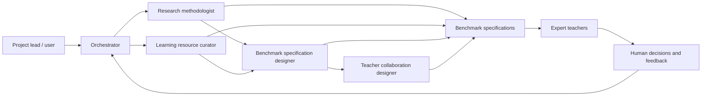
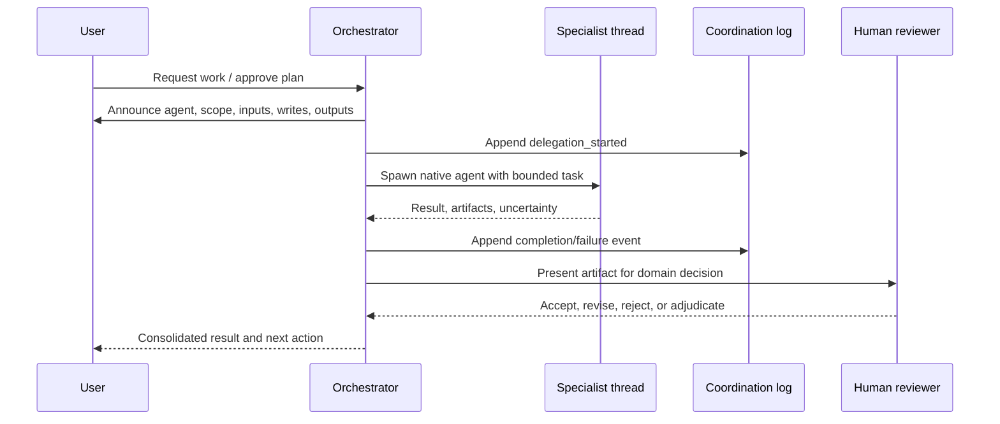

# System architecture

## Goals and principles

The system supports a human-in-the-loop research workflow for a Vietnamese lower-secondary Informatics LLM-tutor benchmark covering grades 6–9. As of 2026-07-23, grades 6–8 are part of the benchmark domain rather than only prerequisite support for grade 9. Its current architecture prioritizes:

- modular plans with explicit file ownership;
- expert-teacher authority over pedagogical and subject-matter decisions;
- canonical specialist definitions with thin runtime adapters;
- native, observable delegation instead of hidden subprocess agents;
- append-only coordination records and artifact-based handoffs;
- fail-closed or single-agent fallback when specialist activity cannot be inspected.

## Vertex requirement-scoring transport

Contract v2 tách dữ liệu thành hai lớp. `benchmark_candidate_id` và
`sample_id` là metadata điều phối do code giữ để chọn pilot, retry, resume
và join kết quả; chúng không được gửi model. User prompt gửi Vertex là một
JSON object có tám trường ngữ nghĩa: `grade`, `lesson`, `position`,
`bloom_level`, `student_prompt`, `conversation_history`,
`source_question` và `gold_answer`.

Runner serialize user prompt đúng một lần, dùng cùng chuỗi cho
`generate_content(contents=...)` và trường `user_prompt` trong record
`run_a.jsonl`/`run_b.jsonl`. Model chỉ trả sáu score; code nối candidate ID
vào normalized response. Validator tái dựng user prompt từ
`pilot_input.csv` và dừng đóng nếu chuỗi lưu không khớp.

## System context



In plain language: the user directs the orchestrator; the orchestrator delegates bounded tasks to specialists. Research and learning-resource work can proceed in parallel; benchmark specification then synthesizes both streams; teacher-collaboration work turns approved or provisional specifications into clear teacher workflows. Expert teachers review pedagogical implications; the orchestrator records and applies the human decisions.

## Components and ownership

| Component | Location | Owner | Status |
|---|---|---|---|
| Canonical specialist skills | `agents/<name>/` | P01 + 20260701 Plan 01 | Implemented for six current specialists |
| Codex adapters | `.codex/agents/` | P01 | Fresh-session runtime smoke-tested |
| Claude adapters | `.claude/agents/` | P01 | Static validation; runtime deferred |
| Skill discovery links | `.agents/skills/` | P01 | Generated and validated by P01 |
| Coordination contract | `experiments/_templates/` | P01 | Implemented by P01 |
| Modular plans | `experiments/<id>/plans/` | Respective plan | Active |
| Shared raw data | `shared/raw_data/` | 20260709 Plan 02 | Implemented for HNMU dialogue manifests lớp 6–9; Plan 04 audit outputs cover lớp 6–7 and a separate follow-up run for lớp 8–9 |
| Shared learning resources | `shared/learning_resources/` | 20260709 Plan 02 layout / Plan 03 content | SGK/SGV images, derived PDFs, registries, Nguyen OCR Markdown for SGK/SGV Tin học 6–9, `ocr_text_manifest.csv`, `learning_resource_fragments.csv`, a rebuildable SQLite FTS retrieval index, and `agent_context/` for audit-agent navigation are available; OCR/MinerU probe outputs remain experiment artifacts and are not the primary retrieval source |
| Shared project package | `src/edu_benchmark/` | 20260709 Plan 02 layout; Plan 03/04 and 20260722 Plans 01–03 add logic | Data I/O, learning-resource fragmentation/retrieval, dialogue-audit v0, strict checklist-to-sample aggregation, deterministic benchmark conversion, and provisional benchmark-specification validation/publication tooling are implemented; model evaluation remains a later plan |
| Benchmark conversion v0 | `src/edu_benchmark/benchmark_conversion/` and `scripts/benchmark_conversion/` | 20260722 Plans 01–02 | Implemented for schema validation, phase-1 evidence aggregation, hash-guarded correction overlays, pass-input joins, the legacy `final_tutor_response` pilot, and reproducible `each_tutor_turn` pilot/full conversion. Published bundles use atomic staging, explicit run status, exhaustive regex/structural validation, and raw-level `conversion_dispositions.csv`. The full pool contains 2,028 preliminary candidates from 665 pass dialogues |
| Chuẩn bị đặc tả benchmark | `src/edu_benchmark/benchmark_specification/` và `scripts/benchmark_specification/` | 20260722 Plan 03 A–C | Đã có khóa input, census/lấy mẫu xác định, mô hình sáu năng lực, schema một nhiệm vụ và sáu nguyên tắc KMP, truy vết nguồn và cơ chế đóng khi lỗi. Nhánh tám nhiệm vụ, schema chính–phụ và phương pháp v3 dùng tập nguyên tắc không thứ tự đều là legacy/chẩn đoán; chưa có nhãn nguyên tắc chính thức. Grounding pool có đủ 2.028 ứng viên và là đầu vào được kế thừa bởi experiment `20260727_170150`. |
| Chấm yêu cầu nguyên tắc | `src/vertex_ai_call/`, `shared/prompts/benchmark_candidate_task_assigning/` và `experiments/20260727_170150/outputs/` | 20260727 Plans 01–03 | Plan 01 công bố V4; Plan 02 hoàn thành full single-run 2.028 candidate và 12.168 score bằng Gemini 3.5 Flash. `analyze_requirement_scoring.py` của Plan 03 kiểm hash/join/request, tính candidate-macro và family-macro, phân bố toàn bộ tập nguyên tắc, semantic lint và eligibility mà không gọi model. UET đã đóng Plan 03 và dùng 1.400 candidate không bị cờ riêng làm pool ưu tiên cho Plan 04; 628 candidate cần review được giữ nguyên làm backlog, 0 candidate bị chặn và review queue 636 dòng gồm 8 mẫu đối chứng. |
| Thư viện rubric hai tầng | `experiments/20260727_170150/outputs/benchmark_rubric/` | 20260727 Plan 04 | Đã triển khai một task, 4 tiêu chí chung, 18 tiêu chí riêng (3 cho mỗi nguyên tắc), 6 lỗi nghiêm trọng và 29 quan hệ provenance. Rubric chung đo điều kiện nền, rubric riêng đo giá trị tăng thêm; serious error chỉ áp một lần theo `suggested_action` và không được cộng như rubric. Sáu năng lực và sáu nguyên tắc đều được bao phủ; artifact đã qua validator nhưng vẫn là provisional, còn pilot chồng lấn/khả năng phân biệt được hoãn sang Plan 07. |
| KSE 2026 manuscript workspace | `kse_submit_manuscript/` | KSE manuscript plan | Plan approved and implementation active. `manuscript/main.tex` now contains the first Introduction and Related Work/Background draft; `references.bib` owns cited metadata, while `notes/claim_evidence_registry.csv` remains the claim–evidence control. Technical plans provide versioned paper-update packets; author metadata and PDF compilation are still pending |
| Quy trình và gói giáo viên | `experiments/20260722_000940/outputs/benchmark_specification/teacher_review_packets/` | 20260722 Plan 03 Workstreams B–D | Hiện lưu hồ sơ UET phê duyệt tạm thời sáu năng lực. Packet C1 của tám nhiệm vụ đã chuyển sang nhánh legacy và không còn chờ review. Packet HNMU hiện hành sẽ là gói tích hợp sáu năng lực–sáu nguyên tắc–rubric–ví dụ sau Workstream D. |
| Benchmark specification specialist | `agents/benchmark-specification-designer/` | 20260701 Plan 01 / P05 support | Implemented as specialist support; benchmark content remains provisional |
| Learning-resource specialist | `agents/learning-resource-curator/` | 20260701 Plan 01 / P06 support | Implemented as v0 mapping support; database platform remains future P06 |
| Pedagogical-principle annotation specialist | `agents/pedagogical-principle-annotator/` | 20260722 Plan 03 Workstream C | Được giữ làm implementation lịch sử của thử nghiệm hai vòng và phục vụ truy vết chẩn đoán. Experiment active không dùng specialist này để chấm candidate; Plan 02 dự kiến gọi Vertex AI bằng một grounding request duy nhất. |
| Benchmark specification | Future P05 artifacts | P05 | Not implemented as official benchmark release |
| Dataset tooling | Future P06 artifacts | P06 | Not implemented as database platform |
| Pipeline đánh giá phản hồi | `src/edu_benchmark/benchmark_evaluation/`, `scripts/benchmark_evaluation/` và `experiments/20260727_170150/outputs/benchmark_evaluation/` | 20260727 Plan 05 | Có native conversation transport, instruction bundle theo phiên bản và các adapter provider. Ba target đã đủ 1.400 response. Contract `gold-answer-only-v4` đã hoàn thành cost-pilot cho Gemini và GPT. Full judge hiện dùng nhánh batch bất đồng bộ riêng cho 1.400 candidate × ba target × hai judge; Gemini dùng GCS/Vertex Batch, GPT dùng OpenAI `/v1/responses`. Manifest, budget, raw output, collect và retry được tách theo provider; runner synchronous cũ vẫn giữ nguyên. |

Canonical logic belongs in `agents/<name>/SKILL.md` and its resources. Runtime adapters may configure discovery and execution but must not fork the workflow logic.

## Delegation sequence



The parent thread remains the decision surface. The user can inspect, steer, stop, or reject specialist delegation on supported runtimes.

## Observability model

Every delegation has:

1. a pre-delegation announcement in the parent thread;
2. a native agent thread when the runtime exposes one;
3. append-only events conforming to `experiments/_templates/coordination-event.schema.json`;
4. a handoff based on `experiments/_templates/handoff.md`;
5. paths to inputs and outputs;
6. a summary of the orchestrator decision and unresolved questions.

Observability covers messages exposed by the runtime, tool activity, artifacts, and decisions. It does not expose or claim access to private model chain-of-thought.

## Runtime model

| Surface | Delegation policy |
|---|---|
| Codex CLI | Use native custom-agent threads; inspect and steer with `/agent`. |
| Codex App | Use native threads when agent activity is visible. |
| Codex IDE Extension | If native visibility is unavailable, fail closed or use the canonical skill in the parent thread as single-agent mode. |
| Claude Code | Keep project adapters compatible; P01 does not run Claude runtime tests. |

Nested `codex exec`, `claude -p`, shell daemons, and hidden terminal agents are prohibited for interactive delegation. Non-interactive automation requires a separate approved plan.

The project keeps specialist fan-out conservative. `research-methodologist` and `learning-resource-curator` are pinned to `gpt-5.4-mini` with medium reasoning for default Codex subagent runs. `benchmark-specification-designer` is pinned to `gpt-5.4-mini` with high reasoning for synthesis. The orchestrator must not spawn multiple copies of the same specialist for one task unless the user explicitly approves the count, rationale, model, reasoning effort, input split, write paths, and merge plan. When fan-out is approved, each branch writes separate artifacts and the orchestrator or a dedicated synthesis task performs the merge.

## Python environment

The project has one authoritative Conda environment with platform-specific executable paths:

```text
Conda environment: benchmark_env
Windows Python: D:\conda-envs\benchmark_env\python.exe
Linux Python:   /home/quannda/miniconda3/envs/benchmark_env/bin/python
```

Package installation, project scripts, validators, and tests must run with the matching `benchmark_env` interpreter for the active platform. Direct Python dependencies are pinned in `requirements.txt`. Agents must not install project packages into Conda base, system Python, or an ad-hoc virtual environment. Temporary isolated tooling is allowed only when an approved plan explicitly requires it and the result does not represent project validation.

## Permissions and safety

- The orchestrator declares allowed read/write paths before delegation.
- Specialists must stay within delegated paths.
- Unsupported or unobservable delegation fails closed.
- Single-agent fallback loads the canonical skill in the parent thread without pretending that a specialist process exists.
- Existing unrelated user changes are preserved.
- Expert-teacher decisions are recorded, not silently rewritten by agents.

## Dependency direction

P01 owns the original agent infrastructure and root coordination contract. The 20260701 specialist-expansion plan adds `learning-resource-curator` as P06 support and `benchmark-specification-designer` as P05 support. P02 may consume the research specialist but does not modify it without a P01 migration. P03/P04 consume teacher-workflow capabilities. P05–P07 still own official benchmark, dataset, and evaluation artifacts respectively.

For experiment `20260709_155523`, Plan 02 owns the shared layout contract:

- `shared/raw_data/` stores unmodified raw inputs and manifests;
- `shared/learning_resources/` stores reusable SGK/SGV assets, OCR, registries, and fragments;
- `src/edu_benchmark/` stores reusable code for data I/O, audit, conversion, learning resources, and benchmark quality checks;
- `experiments/<id>/outputs/` stores run-specific derived outputs.

Plan 03 may populate `shared/learning_resources/` and its learning-resource manifest, but should not redefine the Plan 02 layout without an explicit roadmap update. As of 2026-07-18, Plan 03 Phases 0–2 have copied SGK images, crawled SGV images, created derived PDFs, and produced v0 topic/lesson/position registries for Tin học 6–9. Phase 3 OCR probes remain useful as technical evidence, but the current shared retrieval source is Nguyen OCR Markdown under `shared/learning_resources/ocr_text/`, not the old OCR/MinerU probe outputs. The agreed processed-learning-resource direction is Markdown-first: Markdown pages with front matter and stable anchors are the human-readable artifact and feed SQLite/DuckDB retrieval indexes. Nguyen OCR Markdown for SGK/SGV Tin học 6–9 has been registered as 154 OCR units, split into 2,750 fragments, and indexed in a rebuildable SQLite FTS artifact. All OCR/fragment/index outputs remain `draft` until UET/HNMU review. Plan 04 and Plan 06 should add code under `src/edu_benchmark/` rather than placing reusable scripts inside experiment folders.

For Plan 03 Phases 3–5, reusable learning-resource processing code should live under `src/edu_benchmark/learning_resources/`; thin CLI wrappers may live under `scripts/learning_resources/`. The default `benchmark_env` runs orchestration, layout reconstruction, Markdown export, fragment/index building, tests, and validation. The separate `ocr_vietocr_gpu` Conda environment is reserved for VietOCR GPU recognition only, with intermediate files connecting it back to the `benchmark_env` pipeline.

MinerU local document-parsing probes use a separate `ocr_mineru` Conda environment. This keeps MinerU's Torch/CUDA/document-parsing dependency stack isolated from `benchmark_env` and `ocr_vietocr_gpu`. The `ocr_mineru` environment is for MinerU model/library probes only; project orchestration, validation, and reusable code still belong to `benchmark_env` and `src/edu_benchmark/`.

Plan 03 Phase A adds a book-level MinerU preparation layer under `src/edu_benchmark/learning_resources/mineru_book_phase_a.py`, with thin CLIs in `scripts/learning_resources/prepare_mineru_book_phase_a.py` and `scripts/learning_resources/collect_mineru_book_markdown.py`. The preparation step runs in `benchmark_env`, writes experiment-scoped manifests and filtered PDFs under `experiments/20260709_155523/outputs/mineru_book_phase_a/`, and emits commands for the user to run MinerU outside the sandbox in `ocr_mineru`. Raw source images remain unchanged; by default, original pages `1-4` and the final 2 pages are excluded only through manifests and derived PDFs. The follow-up post-processing layer lives in `src/edu_benchmark/learning_resources/mineru_postprocess.py` and `scripts/learning_resources/postprocess_mineru_book_phase.py`; it runs in `benchmark_env`, reads MinerU `*_content_list_v2.json`, writes cleaned page-level Markdown under the experiment output folder, and creates a review queue instead of silently promoting pages to shared parsed learning resources.

Plan 04 adds deterministic dialogue-audit tooling under `src/edu_benchmark/data_io/` and `src/edu_benchmark/dialogue_audit/`, with a CLI in `scripts/dialogue_audit/`. The completed Plan 04 v0 lớp 6–7 run writes under `experiments/20260709_155523/outputs/hnmu_dialogue_audit/`. A separate explicit follow-up audit for lớp 8–9 now writes under `experiments/20260709_155523/outputs/hnmu_dialogue_audit_grade8_9/`, with its 3-shard specialist checklist output under `agent_shard_audit/`. In each merged agent-audit output, `quality_check_suggestions.csv` is the main sample-level review file and uses the canonical `quality_decision` labels `pass`, `need_human_review`, and `failed`; `raw_dialogue_checklist_results*.csv` remains the detailed criterion-level source of truth. The audit is a v0 mechanical/retrieval/agent-assisted pass, not final HNMU/UET subject-matter adjudication.

Experiment `20260722_000940` Plan 01 adds the deterministic conversion layer under `src/edu_benchmark/benchmark_conversion/`, with thin CLIs under `scripts/benchmark_conversion/`. It joins normalized raw rows, sample-level quality decisions, and the detailed checklist without modifying inherited snapshots. The conversion input keeps phase-1 blocking evidence separate from the union of all criterion-level evidence. Its pilot strategy uses the initial student turn as `student_prompt`, intermediate turns as structured `conversation_history`, and the final AI turn as `gold_response`; `answer_sgv` becomes `gold_answer`. Project-lead-approved corrections are stored separately with source-dialogue hashes: `raw_dialogue` remains immutable provenance, while `conversion_dialogue` is the effective text and `dialogue_correction_ids` records applied decisions.

Plan 02 implements the versioned `each_tutor_turn` contract: every AI turn becomes a target response, the initial student turn remains the fixed prompt, and only the prefix between that prompt and the target becomes history. Suffix turns are excluded from candidate content, including the last student turn in dialogues that end with `HS`. A 20-dialogue migration pilot passed before the full run produced 2,028 candidates from all 665 pass inputs with zero blocking errors. The candidate CSV intentionally contains only 10 content/key columns; source paths, correction IDs, and target turn indices live in a separate one-to-one trace table, and raw-level conversion outcomes live in `conversion_dispositions.csv`. Before publication, the pipeline serializes the entire bundle into a sibling staging directory, regex-parses all `HS:/AI:` turns, verifies every candidate/trace/disposition mapping, writes `run_status.json`, and atomically swaps the complete directory into place. A failed rerun publishes only failure status and errors, so stale candidate files cannot remain at the active output path. Candidates sharing a `sample_id` form a family that downstream data splits must keep together. Plan 03 owns task/rubric assignment and disposition; Plan 04 owns candidate evidence and quality audit.

Workstreams A–B của experiment `20260722_000940` bổ sung tầng đặc tả từ nền tảng đo lường và công bố mô hình sáu năng lực sau khi kiểm khả năng quan sát, đủ 15 cặp ranh giới và truy vết nghiên cứu. UET phê duyệt tạm thời sáu năng lực làm nền rubric, không phải xác nhận HNMU. Grounding pool có 2.028 dòng, 665 family và không chứa `gold_response`. Các phương pháp C cũ—tám nhiệm vụ, chính–phụ, tập nhãn không thứ tự và giao thức hai vòng—đều được bảo toàn làm legacy/chẩn đoán; không có nhãn nguyên tắc chính thức. Experiment `20260727_170150` là chủ sở hữu active của bước kế tiếp. Plan 01 đã khóa đặc tả một lượt grounding, trong đó system prompt tiếng Việt tại `shared/prompts/benchmark_candidate_task_assigning/` nhận context, `source_question` và `gold_answer` để chấm đủ sáu `requirement_score`. Contract V4 giữ schema V2 nhưng bắt buộc điểm `4`–`5` nêu nhu cầu độc lập và hệ quả khi bỏ nguyên tắc; Feedback và Questioning có cổng riêng. Hai calibration cho thấy Gemini 3.5 cải thiện expected range nhưng kém ổn định A/B; UET quyết định đóng calibration ở mức chẩn đoán và chạy một lần trên full pool. Full run dùng `gemini-3.5-flash`, không gửi `temperature`, `top_p`, `top_k` hoặc `thinking_budget`, dùng `thinking_level=MEDIUM`, `include_thoughts=false`, `max_output_tokens=4096`, seed `20260727`, concurrency 20 và bundle `full_gemini35_medium_v1`. Hai candidate lỗi sau lượt chạy chính được lệnh `retry-failed` chạy bù mà không gửi lại 2.026 candidate đã thành công; bundle cuối có 2.028 record duy nhất và 12.168 score. Plan 03 đã phân tích bundle bằng code, ghi ba artifact tinh gọn và evidence registry KSE: 1.400 candidate `eligible_without_plan03_review`, 628 `needs_uet_review`, 0 `blocked`. Cờ lớn nhất là 592 trường hợp Feedback điểm cao nhưng rationale chỉ chứng minh nhu cầu xác nhận/khen, chưa chứng minh hướng cải thiện; đây là cờ regex chờ UET disposition, không phải tự động sửa score. Full run vẫn không cho phép báo agreement hoặc accuracy. Nếu sau này dùng rubric riêng theo nguyên tắc, tập bắt buộc phải được đưa công khai vào instruction của tutor để tránh yêu cầu ẩn. `gold_response` chỉ xuất hiện sau khi requirement, instruction và rubric đã khóa.

Plan 05 đã bổ sung transport sinh phản hồi gia sư dưới
`src/edu_benchmark/benchmark_evaluation/`. Transport không tái sử dụng
cách đóng gói JSON của requirement-scoring: `student_prompt` trở thành
message `user` đầu tiên, từng lượt `conversation_history` được giữ nguyên
ranh giới và ánh xạ `student → user`, `tutor → assistant/model`, rồi
provider adapter chuyển chuỗi message trung gian sang role native của API.
System instruction được gửi riêng; gold, rubric, evidence và metadata điều
phối không được gửi target tutor. Reusable transport thuộc
`dialogue_transport.py`, còn `provider_adapters.py` chỉ sở hữu ánh xạ SDK.
`prompt_builder.py` ghép instruction ứng viên từ bundle có phiên bản,
`costing.py` dừng trước batch có thể vượt hard cap 250 USD,
`config_builder.py` cùng `validation.py` sinh và kiểm bốn artifact tối thiểu.
CLI dưới `scripts/benchmark_evaluation/` xây cấu hình cục bộ và chuẩn bị
smoke test tối đa 10 candidate cho Gemini managed API hoặc Llama MaaS.
Runner ghi target response tăng dần vào `run_smoke.jsonl`; khi API lỗi,
nó in exception ngay qua progress display và ghi từng attempt vào
`run_errors.jsonl` gồm HTTP status/body và traceback nhưng không chứa
prompt hay credential. Lỗi 4xx không thể hồi phục dừng ngay thay vì đi
qua retry loop; lỗi quota tạm thời và 5xx vẫn dùng `max_retries`.
Smoke runner ghi JSONL tăng dần, resume, retry theo lượt, hiển thị progress
bằng `tqdm` với ETA, tốc độ, số hoàn tất và số lỗi đang chờ thử lại, đồng
thời cần cờ `--execute-api`. Cấu hình và mọi run sinh/chấm của cùng phase
được gom dưới `outputs/benchmark_evaluation/`; mỗi run dùng một thư mục
con mang `run_id`.
Nội dung instruction không nằm trong hằng số Python. Các bundle có phiên
bản nằm dưới
`shared/prompts/benchmark_tutor_response_generation/`: `v1` bảo toàn
baseline smoke đầu tiên, còn `v2` bổ sung ràng buộc trả lời cô đọng và
kết thúc trọn câu. `instruction_bundle.py` kiểm schema, thứ tự
sáu nguyên tắc, tên tiếng Việt, khuôn dựng và SHA-256. `prompt_builder.py`
dựng các khối nhiều dòng từ bundle, còn `instruction_registry.csv` chỉ là
view phục vụ review và giữ tóm tắt căn cứ cùng vị trí nguồn. Smoke manifest
và từng target response giữ version/hash bundle; resume với bundle khác
phải dừng đóng và dùng output directory mới. Các cột provenance không
được đưa vào request.
Target record lưu nguyên `system_prompt`, `user_prompt` cuối cùng và toàn
bộ `conversation_messages` có role, đồng thời giữ hash để validator đối
chiếu nội dung. `experiment_id`, `plan_id`, `pipeline_stage` và `run_id`
giữ khả năng nhận diện phase ngay cả khi record bị tách khỏi thư mục.
Runner còn chuẩn hóa và lưu `finish_reason` giữa Gemini và API
OpenAI-compatible. `MAX_TOKENS`, `length` hoặc lý do không thành công khác
được ghi `needs_review`; manifest không được chuyển sang `completed`.
Smoke so sánh prompt có thể khóa đúng danh sách candidate từ manifest run
trước thay vì dựa lại vào phép lấy mẫu.
SocraticLM là provider tự triển khai riêng: `vertex_endpoint.py` sở hữu
caller `rawPredict`, còn `manage_socraticlm_endpoint.py` sở hữu build,
deploy, status và cleanup của custom vLLM endpoint. Lifecycle manifest
experiment-scoped là khóa an toàn giữa hai phần: runner chỉ gọi đúng
endpoint còn sống, đúng project/model/location và chưa quá `delete_by`.
Billing của nhánh này được ghi theo thời gian endpoint; không quy đổi giả
thành giá token. Cleanup dừng đóng khi lệnh xóa lỗi để không che giấu GPU
còn đang tính phí. Các caller Gemini và Llama MaaS không bị sửa giao thức.
Trước khi upload Model Registry resource, lifecycle manager cấp
`roles/artifactregistry.reader` ở phạm vi repository cho đúng Vertex AI
Service Agent được suy ra từ project number. Failed deployment chỉ được
resume khi chưa sở hữu model/endpoint; image đã build được kiểm tra và tái
sử dụng. Mọi lỗi gcloud giữ structured diagnostics trong manifest.
Resource name sau upload/create không được parse trực tiếp từ stdout:
lifecycle manager truy vấn lại Model Registry hoặc Endpoint Registry bằng
display name và image URI. Không có kết quả hoặc có nhiều hơn một kết quả
đều dừng đóng; resource duy nhất được phục hồi vào manifest để resume.
Ranh giới Plan 05 tái lập `required_principle_ids` trực tiếp từ đúng các
`requirement_score >= 4` rồi đối chiếu với bundle nguồn. Điểm `3` chỉ còn
là provenance chẩn đoán của Plan 02/03, không được dùng để tạo instruction,
chọn rubric, gửi judge hoặc tổng hợp điểm. Evaluation schema bắt buộc bốn
rubric chung và đúng ba rubric của mỗi nguyên tắc bắt buộc, đồng thời cấm
rubric riêng của mọi nguyên tắc ngoài tập.

Plan 05 còn bổ sung tầng chấm mù cặp phản hồi trong `judge.py`, với
transport tách biệt tại `claude_judge.py`, `gemini_judge.py` và
`openai_judge.py`, cùng CLI điều phối `run_claude_judge_smoke.py` có lựa
chọn provider. Builder v2 join candidate, gold, target output, requirement
set và fragment SGK/SGV; code chọn rubric, tráo thứ tự bằng seed và khôi
phục `Win/Tie/Lose` sau khi judge trả JSON. User prompt dùng Markdown;
fragment được nhóm theo đúng cặp tên sách–tên bài học, chỉ heading và
content đi vào request. Claude transport dùng ADC và Vertex `rawPredict`;
Gemini transport dùng native system/user qua Google Gen AI SDK và
thread-local client. OpenAI transport dùng Responses API, system/user tách
biệt, snapshot `gpt-5.4-mini-2026-03-17`, Structured Outputs nghiêm ngặt,
`store=false` và retry do runner sở hữu. API key chỉ đọc từ `src/.env`, bị
Git bỏ qua và không tham gia manifest. System prompt tiếng Việt có phiên
bản nằm dưới `shared/prompts/benchmark_response_judging/`.

Model ID, ID nội bộ và ánh xạ target–reference không đi vào request, nhưng
prompt/hash/ánh xạ và fragment ID được lưu trong record để audit. Giao diện
model chỉ dùng tên tiêu chí và tên lỗi. Code tính giao giữa rubric bị lỗi
ảnh hưởng với rubric đang áp dụng, kiểm tên rồi ánh xạ về ID. Mỗi lỗi được
đánh giá độc lập trên hai phản hồi. Hậu xử lý giữ cả raw và adjusted
criterion judgments; cổng xác định ép `Lose` khi target mắc lỗi, `Win` khi
chỉ reference mắc lỗi, và vẫn `Lose` khi cả hai mắc. Nhiều lỗi trên một
tiêu chí chỉ tạo một adjustment. CLI dùng `ThreadPoolExecutor`; mỗi worker
Gemini sở hữu client thread-local, còn số worker được khóa trong wrapper và
manifest. Mỗi exception được in ngay lên terminal bằng `tqdm.write` dưới dạng
full diagnostic gồm traceback, finish reason, partial response và usage;
chính record đó cũng được ghi tăng dần vào `run_errors.jsonl`. Cost accounting cộng cả judgment thành công và
attempt lỗi có usage; không được chỉ tính record đã parse thành công. Khi
thay đổi generation config, runner phải dùng run directory mới thay vì
resume record khác cấu hình. CLI sở hữu retry, resume, `tqdm`, JSONL tăng
dần, manifest và budget gate; logic blinding/rubric/gate không được sao chép
vào CLI.

Plan 05 hỗ trợ hai contract judge song song trên cùng builder và provider
callers. `v2` bảo toàn hành vi lịch sử có serious-error detection/gate.
`rubric-only-v3` không đọc catalog lỗi, không đưa lỗi vào system/user prompt
và yêu cầu model chỉ trả criterion judgments cùng overall judgment. Runner
chuẩn hóa record v3 về schema lưu trữ tương thích bằng
`serious_error_findings: []`, `criterion_adjustments: []` và
`adjusted_criterion_judgments == raw_criterion_judgments`. Contract version,
prompt hash và request hash ngăn resume chéo giữa v2/v3. Structured Outputs
của OpenAI được dựng động theo contract. Gemini dùng schema cấu trúc rút gọn
để tránh giới hạn độ phức tạp của Vertex, còn validator local vẫn kiểm chính
xác tên và độ phủ rubric; provider không được tự ánh xạ ID. Wrapper v3 chạy
hai provider vào các thư mục mới, resume theo `comparison_id` và đã hoàn tất
90/90 record hợp lệ cho mỗi provider mà không sửa bundle v2 hoặc target
response.

Contract `gold-answer-only-v4` mở thêm một nhánh ablation mà không thay đổi
v2/v3. Builder không đọc conversion evidence hoặc fragment registry ở nhánh
này, bỏ section học liệu khỏi request, giữ evidence IDs rỗng và ghi
`learning_evidence_included=false`. `RUB-GEN-ACC` vẫn giữ ID nội bộ nhưng có
tên/anchor hiển thị riêng dựa duy nhất trên `gold_answer`; các rubric còn lại,
blinding, provider callers, structured output, hậu xử lý và schema record
được dùng lại. Prompt hash, contract version và output directory ngăn resume
chéo. Wrapper v4 chạy cùng 90 phép so sánh cho Gemini và GPT vào hai bundle
mới; v2/v3 và toàn bộ target response là read-only provenance.
Tên tiêu chí vẫn được kiểm nghiêm ngặt; riêng v4 chấp nhận một alias đã
quan sát của `RUB-EXP-ADAPT` rồi chuẩn hóa về tên canonical. Wrapper tách
`GEMINI_MAX_OUTPUT_TOKENS` và `OPENAI_MAX_OUTPUT_TOKENS`, nên recovery có
thể tăng giới hạn một provider mà không đổi cấu hình provider còn lại.

Plan 05 bổ sung đường full judge bất đồng bộ mà không thay runner đồng bộ.
`batch_judge.py` sở hữu serialization request theo provider, parse raw
output, validator/hậu xử lý chung và cost projection; `run_batch_judge.py`
sở hữu lifecycle prepare–submit–status/watch–collect–retry. Vertex Gemini
lưu JSONL qua GCS và OpenAI dùng Batch API `/v1/responses`. Mỗi provider có
manifest và output riêng dưới một root full-batch; chỉ record lỗi được retry,
final JSONL chỉ publish `completed` khi đủ 4.200 comparison đúng hash. Budget
Gemini và OpenAI không được cộng chung: mỗi nhánh dùng pilot-v4 p95 theo đơn
giá batch, stage cap và remaining budget riêng. Recovery full run cho phép
chuẩn hóa cục bộ duy nhất các alias tên tiêu chí đã quan sát và ánh xạ chính
xác về tên canonical; các tên không biết vẫn fail closed. Giới hạn token gốc
được giữ trong fingerprint, còn `retry-max-output-tokens` chỉ áp dụng và được
ghi provenance cho attempt retry mới. Full run hiện đã hoàn thành
4.200/4.200 judgment cho từng judge; attempt cuối của Gemini chỉ gửi lại hai
request `MAX_TOKENS` ở giới hạn 9.000 token.

Section V analysis is a deterministic post-processing layer under
`src/edu_benchmark/benchmark_evaluation/section_v_ablation.py`, with the thin
CLI `scripts/benchmark_evaluation/analyze_section_v_ablation.py`. It reads
only the locked 1,400-candidate pool and the two 4,200-record full judge
bundles, applies paired family-cluster bootstrap and agreement statistics,
validates paper-facing anchors, then atomically publishes one
experiment-scoped `results.json`. This layer never calls model providers and
does not modify judge or target-response artifacts.

Later plans must not move canonical logic into runtime adapters or redefine P01 coordination semantics without an explicit architecture decision and migration plan.

## Extension points

- Add a specialist by creating one canonical skill, thin Codex/Claude adapters, tests, and an ownership declaration.
- Add a runtime by writing an adapter and observability policy without changing canonical workflows.
- Add an automated pipeline only through a separately approved non-interactive plan.
- Add architectural decisions as individual ADRs under `docs/decisions/` when the first durable cross-plan decision requires one.

## Known limitations and open decisions

- Codex IDE subagent visibility may be incomplete; CLI/App are the P01 audit surfaces.
- Claude adapters are not runtime-tested in P01.
- Coordination events are file-based and not yet backed by a database or UI.
- Native transcripts depend on runtime retention and do not include private chain-of-thought.
- Benchmark taxonomy, dataset schema, and evaluation metrics remain provisional or unimplemented; the new benchmark-specification specialist produces candidate specifications, not final HNMU-approved benchmark content.
- Direct Python dependencies are pinned in `requirements.txt`; a complete Conda environment export and transitive lockfile have not yet been assigned to a dedicated plan.

Last verified against P01 on 2026-06-21.

### HNMU dialogue auditor specialist

`hnmu-dialogue-auditor` is a narrow Plan 04 specialist. It audits raw HNMU dialogue rows with the raw-dialogue checklist, SGK/SGV retrieval evidence, and the canonical HNMU scaffolding note. It writes criterion-level checklist rows and review suggestions; it does not edit raw Excel files, create benchmark samples, assign official tasks, or replace HNMU/UET judgment.
