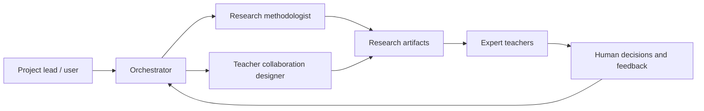
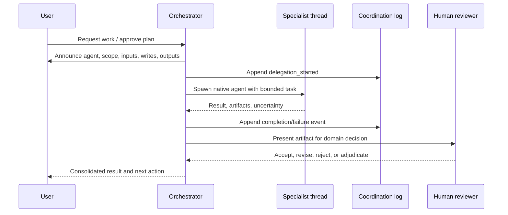

# System architecture

## Goals and principles

The system supports a human-in-the-loop research workflow for a Vietnamese grade-9 Informatics LLM-tutor benchmark. Its current architecture prioritizes:

- modular plans with explicit file ownership;
- expert-teacher authority over pedagogical and subject-matter decisions;
- canonical specialist definitions with thin runtime adapters;
- native, observable delegation instead of hidden subprocess agents;
- append-only coordination records and artifact-based handoffs;
- fail-closed or single-agent fallback when specialist activity cannot be inspected.

## System context



In plain language: the user directs the orchestrator; the orchestrator delegates bounded tasks to specialists; specialists produce auditable artifacts; expert teachers review pedagogical implications; the orchestrator records and applies the human decisions.

## Components and ownership

| Component | Location | Owner | Status |
|---|---|---|---|
| Canonical specialist skills | `agents/<name>/` | P01 | Implemented by P01 |
| Codex adapters | `.codex/agents/` | P01 | Fresh-session runtime smoke-tested |
| Claude adapters | `.claude/agents/` | P01 | Static validation; runtime deferred |
| Skill discovery links | `.agents/skills/` | P01 | Generated and validated by P01 |
| Coordination contract | `experiments/_templates/` | P01 | Implemented by P01 |
| Modular plans | `experiments/<id>/plans/` | Respective plan | Active |
| Teacher workflow and packet | Future P03/P04 artifacts | P03/P04 | Not implemented |
| Benchmark specification | Future P05 artifacts | P05 | Not implemented |
| Dataset tooling | Future P06 artifacts | P06 | Not implemented |
| Evaluation pipeline | Future P07 artifacts | P07 | Not implemented |

Canonical logic belongs in `agents/<name>/SKILL.md` and its resources. Runtime adapters may configure discovery and execution but must not fork the workflow logic.

## Delegation sequence



The parent thread remains the decision surface. The user can inspect, steer, stop, or reject specialist delegation on supported runtimes.

## Observability model

Every delegation has:

1. a pre-delegation announcement in the parent thread;
2. a native agent thread when the runtime exposes one;
3. append-only events conforming to `experiments/_templates/coordination-event.schema.json`;
4. a handoff based on `experiments/_templates/handoff.md`;
5. paths to inputs and outputs;
6. a summary of the orchestrator decision and unresolved questions.

Observability covers messages exposed by the runtime, tool activity, artifacts, and decisions. It does not expose or claim access to private model chain-of-thought.

## Runtime model

| Surface | Delegation policy |
|---|---|
| Codex CLI | Use native custom-agent threads; inspect and steer with `/agent`. |
| Codex App | Use native threads when agent activity is visible. |
| Codex IDE Extension | If native visibility is unavailable, fail closed or use the canonical skill in the parent thread as single-agent mode. |
| Claude Code | Keep project adapters compatible; P01 does not run Claude runtime tests. |

Nested `codex exec`, `claude -p`, shell daemons, and hidden terminal agents are prohibited for interactive delegation. Non-interactive automation requires a separate approved plan.

## Python environment

The project has one authoritative Conda environment with platform-specific executable paths:

```text
Conda environment: benchmark_env
Windows Python: D:\conda-envs\benchmark_env\python.exe
Linux Python:   /home/quannda/miniconda3/envs/benchmark_env/bin/python
```

Package installation, project scripts, validators, and tests must run with the matching `benchmark_env` interpreter for the active platform. Direct Python dependencies are pinned in `requirements.txt`. Agents must not install project packages into Conda base, system Python, or an ad-hoc virtual environment. Temporary isolated tooling is allowed only when an approved plan explicitly requires it and the result does not represent project validation.

## Permissions and safety

- The orchestrator declares allowed read/write paths before delegation.
- Specialists must stay within delegated paths.
- Unsupported or unobservable delegation fails closed.
- Single-agent fallback loads the canonical skill in the parent thread without pretending that a specialist process exists.
- Existing unrelated user changes are preserved.
- Expert-teacher decisions are recorded, not silently rewritten by agents.

## Dependency direction

P01 owns agent infrastructure and root documentation. P02 may consume the research specialist but does not modify it without a P01 migration. P03/P04 consume teacher-workflow capabilities. P05–P07 own benchmark, dataset, and evaluation artifacts respectively.

Later plans must not move canonical logic into runtime adapters or redefine P01 coordination semantics without an explicit architecture decision and migration plan.

## Extension points

- Add a specialist by creating one canonical skill, thin Codex/Claude adapters, tests, and an ownership declaration.
- Add a runtime by writing an adapter and observability policy without changing canonical workflows.
- Add an automated pipeline only through a separately approved non-interactive plan.
- Add architectural decisions as individual ADRs under `docs/decisions/` when the first durable cross-plan decision requires one.

## Known limitations and open decisions

- Codex IDE subagent visibility may be incomplete; CLI/App are the P01 audit surfaces.
- Claude adapters are not runtime-tested in P01.
- Coordination events are file-based and not yet backed by a database or UI.
- Native transcripts depend on runtime retention and do not include private chain-of-thought.
- Benchmark taxonomy, dataset schema, and evaluation metrics remain provisional or unimplemented.
- Direct Python dependencies are pinned in `requirements.txt`; a complete Conda environment export and transitive lockfile have not yet been assigned to a dedicated plan.

Last verified against P01 on 2026-06-21.
